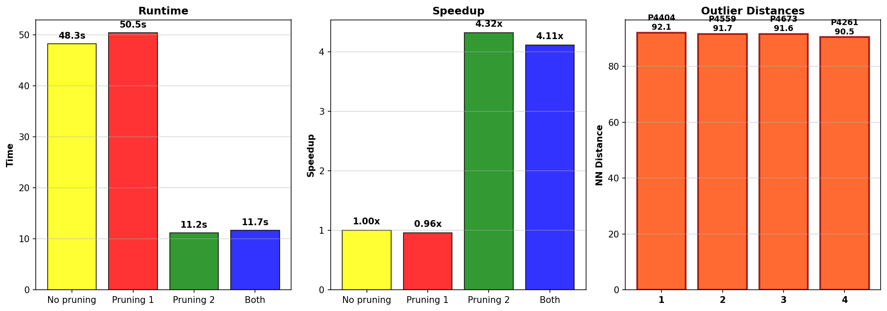
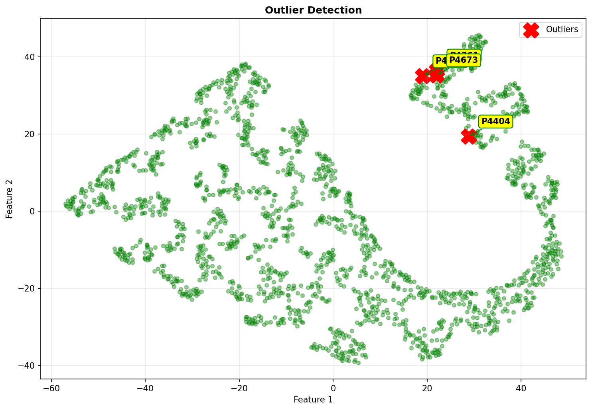

# Outlier Detection with Distance-Based Pruning

Implementation of a distance-based outlier detection algorithm from scratch 
with two pruning strategies to improve computational efficiency. Applied to 
a 5,000-sample subset to identify the top 4 outliers by nearest-neighbor distance.

## How to Run
1. Create a virtual environment: `python -m venv venv`
2. Activate it: `venv\Scripts\activate` (Windows) or `source venv/bin/activate` (Mac/Linux)
3. Install dependencies: `pip install -r requirements.txt`
4. Place `data.txt` inside a `data/` folder
5. Run: `jupyter notebook outlier_detection.ipynb`

## File Manifest
1. `outlier_detection.ipynb` — Main notebook. Includes outlier detection implementation, pruning strategies, performance comparison, and visualization.
2. `requirements.txt` — All required packages and versions.

## Results

### Execution Time Comparison
| Configuration | Time | Speedup |
|---|---|---|
| No Pruning | 54.6s | 1x |
| Pruning 1 only | 56.6s | 0.96x |
| Pruning 2 only | **12.1s** | **4.5x** |
| Both | 13.1s | 4.2x |

### Top 4 Outliers Identified
| Rank | Point Index | NN Distance |
|---|---|---|
| 1 | 4404 | 92.0828 |
| 2 | 4559 | 91.6544 |
| 3 | 4673 | 91.6297 |
| 4 | 4261 | 90.4835 |

All four configurations correctly identified the same outliers.

## Usage
Pruning 2 is recommended as the most effective strategy — it provided 
a 4.5x speedup over the brute-force baseline while maintaining correctness.

